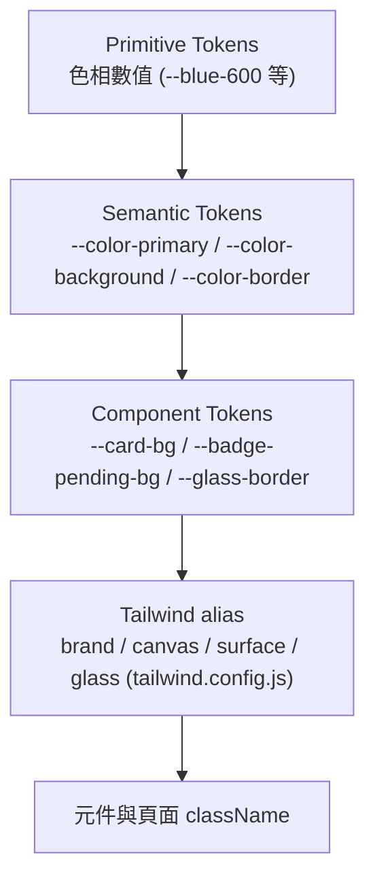
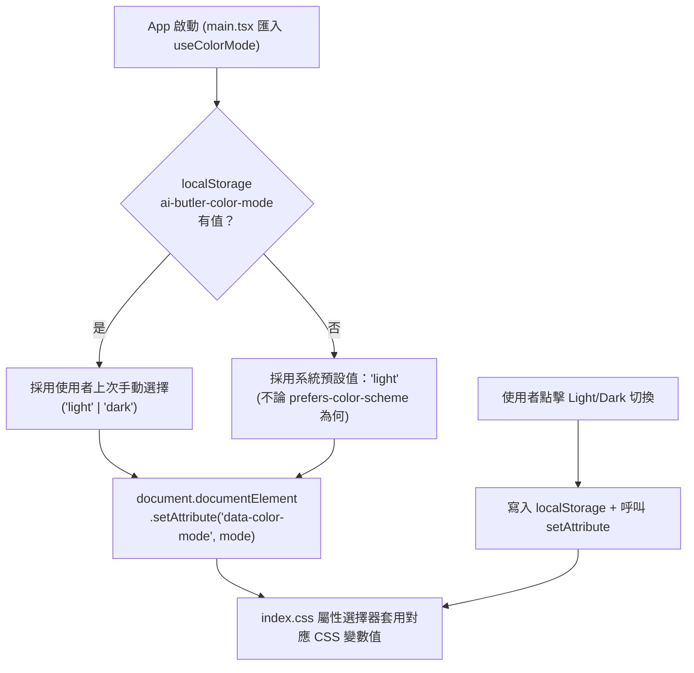

# Design Document: App 視覺大改版（Guarrent 科技風 + Light/Dark 雙模式）

## Overview

這份設計文件定義「AI 智慧生活服務管家」App 的整體視覺重製方案。範圍是**全站 restyle**：14 個既有頁面（LandingPage、LoginPage、HomePage、NewRequestPage、ServiceFormPage、RequestDetailPage、MyServicesPage、ReservationFlowPage、DeliveryFlowPage、ShopFlowPage、HealthRecommendationPage、VendorLoginPage、VendorRequestsPage、VendorRequestDetailPage）與其共用元件（Mascot、ServiceIcon、ChatMessage、ButlerPanel/ButlerLauncher、ReservationDatePicker、TimeSlotSelector、RestaurantCard、StatusBadge、Toast、ConfirmModal、ThemeMenu 等）全部套用新視覺系統。**`frontend/src/App.tsx` 的路由結構與頁面對應關係完全不變**，這是純視覺置換，不調整資訊架構、不合併/拆分頁面、不改資料流或 API 呼叫邏輯。

新視覺方向直接參照使用者提供的「Guarrent 風格」參考圖：手機 mockup 置中展示、周圍漂浮圓角徽章卡片、大範圍藍色科技漸層背景、巨大半透明背景大字紋理、玻璃擬態卡片、真實人物頭像徽章、現代 SaaS/App 行銷質感。這是使用者的明確選擇，**直接照辦，不受限於現有 `PRODUCT.md` 中「溫暖、可靠、安心、避免炫技科技感、避免深色賽博風」的品牌敘述**。

> **⚠️ 品牌文件衝突提醒**：`PRODUCT.md` 的 Brand Personality／Anti-references／Design Principles 第 5 點（機器人管家可自訂顏色）與這次改版方向直接衝突（該文件明確排斥「深色賽博風、誇張漸層、密集資訊卡片」，且明確定義 Mascot 可自訂顏色為品牌個性核心）。這是使用者本次明確拍板的選擇，設計上不會回頭套用溫暖風格；但完成後**建議另找時間更新 `PRODUCT.md` 與 `DESIGN.md`**，讓文件與實際產品一致，避免未來其他協作者依據舊文件做出衝突的設計決策。本次不會修改 `PRODUCT.md`/`DESIGN.md` 本文，僅在 `docs/` 下新增一份標記為本次改版專用的品牌敘述（見〈Dependencies〉一節）。

第二個核心改動：拿掉現有「機器人管家可自訂 5 色系」機制（`useTheme.ts` 的 `THEMES` 陣列 + `ThemeMenu.tsx` 的色塊選單 + `Mascot` 的 `bodyColor`/`highlightColor` 覆寫 prop），改為**單一品牌主色（信賴科技藍 Trust Blue）+ Light/Dark 雙模式切換**，概念上類似 VS Code 的 Light/Dark Theme，而不是「換膚」。

---

## Design Decisions Confirmed with User

| 決策點 | 結果 | 理由 |
|---|---|---|
| 首次載入預設模式 | **Light 預設** | 對初次使用者（含高齡使用者）反差較小，之後可手動切換到 Dark；仍會偵測 `prefers-color-scheme` 作為「使用者從未手動選過」時的次要依據，但系統預設值本身固定為 Light。 |
| 品牌主色 | **信賴科技藍 Trust Blue**（`#2563EB` → `#60A5FA`）| 三個選項中風險最低、科技感與可信賴感兼具，比電光藍（`#0052FF`）更容易在 Light 模式維持文字對比，比深海漸層更容易套用到密集資訊頁（廠商後台、表單）。 |

以下決策由設計判斷決定並在對應章節說明理由：Dark mode 背景色階、玻璃擬態在深色模式的透明度調整、字型配對、圖片來源策略、Mascot 新 prop 介面。

---

## Architecture

### 1. Token 三層架構

沿用 `.kiro/steering` 中 `design-system` skill 建議的三層模型（Primitive → Semantic → Component），但**不整套換掉 Tailwind config 的結構**，只換 `index.css` 裡 CSS 變數的值與新增變數，維持 `tailwind.config.js` 現有 `brand` / `canvas` / `accent` 等別名指向 CSS 變數的做法（風險最低、改動面最小）。



### 2. 色彩模式解析流程（取代 `useTheme.ts` 的多色系統）



**關鍵決策**：預設值固定為 `light`，**不**用 `prefers-color-scheme` 做初始預設（避免系統偏好造成「使用者以為壞掉」的第一印象不一致），但 `prefers-color-scheme` 仍可作為之後 `ThemeMenu`／設定選單中「跟隨系統」選項的依據（第三個模式，非本次必做，見〈Testing Strategy〉後的〈Future Extension〉附註）。这与专案既有的 `prefers-reduced-motion` 侵入式全域規則（不询问、直接尊重系统设定）刻意採不同策略，因为色彩模式对可用性影响远大于动效，需要使用者可感知、可掌控的手動切換入口，不能只靠系统侵入式判断。

### 3. 元件重構範圍

| 現有檔案 | 處置 | 說明 |
|---|---|---|
| `frontend/src/hooks/useTheme.ts` | **取代**為 `frontend/src/hooks/useColorMode.ts` | 移除 `THEMES` 陣列與 `setTheme(id)` API，改為 `mode` / `setMode('light' \| 'dark')` / `toggle()`。 |
| `frontend/src/components/ThemeMenu.tsx` | **重構**為 `frontend/src/components/AppearanceMenu.tsx` | 選單內容從「5 色塊 + 無障礙開關 + 重看導覽」改為「Light/Dark 切換 + 無障礙開關 + 重看導覽」。檔名調整以反映新用途（原檔名語意已不符）。 |
| `frontend/src/components/Mascot.tsx` | **修改** props 介面 | 移除 `bodyColor` / `highlightColor` 任意色覆寫，改為受控的 `tone` 列舉（見下方介面定義）。造型 SVG 結構不變。 |
| `frontend/src/index.css` | **重寫** `:root` 與 `html[data-theme="..."]` 區塊 | 改為 `html[data-color-mode="light"]` / `html[data-color-mode="dark"]`，並新增玻璃擬態、漸層、大字紋理相關工具類別。 |
| `frontend/src/pages/LandingPage.tsx` | **重寫視覺**，行為/路由不變 | 移除 `THEMES` 色塊預覽 UI，改為 Guarrent 風格 hero（手機 mockup + 漂浮徽章 + 大字紋理）。 |
| 其餘 12 個頁面 + 所有共用元件 | **只換 className / 少量結構性 wrapper**，不動資料邏輯 | 詳見〈Page-by-Page Application〉。 |

---

## Components and Interfaces

### ColorMode 型別與 Hook 介面

```typescript
export type ColorMode = "light" | "dark";

export interface UseColorModeResult {
  /** 目前生效的模式 */
  mode: ColorMode;
  /** 直接指定模式並持久化 */
  setMode: (mode: ColorMode) => void;
  /** 在 light/dark 間切換並持久化 */
  toggle: () => void;
}

/** 取代 useTheme()。實作沿用既有 useSyncExternalStore + 模組層級狀態 + Set 監聽器模式（不引入 Context），
 *  維持與 useAccessibilityMode.ts 一致的既有寫法慣例。 */
export function useColorMode(): UseColorModeResult;
```

**持久化規則**：
- localStorage key：`"ai-butler-color-mode"`（比照現有 `"ai-butler-theme"` / `"ai-butler-a11y"` 命名風格）。
- 讀取失敗（無 localStorage／private mode）時 fallback 為 `"light"`，不拋出例外（沿用現有 `useTheme.ts`/`useAccessibilityMode.ts` 的 try/catch 靜默失敗慣例）。
- 寫入 DOM 屬性：`document.documentElement.setAttribute("data-color-mode", mode)`。

### Mascot 新介面（移除自訂顏色）

```typescript
export type MascotTone = "brand" | "inverted" | "muted";

interface MascotProps {
  size?: number;
  className?: string;
  /**
   * "brand"（預設）：body 用 --color-mascot-body、眼睛/天線用 --color-mascot-accent，隨 Light/Dark 模式自動變化。
   * "inverted"：body/眼睛皆用白色系（用於深色漸層 hero 卡片上的裝飾性大型 Mascot，取代舊有的
   *   bodyColor="#FFFFFF" highlightColor="#FFFFFF" 寫法）。
   * "muted"：低對比灰藍版本，用於背景裝飾、不搶視覺焦點的情境（如大字紋理旁的浮水印小圖標）。
   */
  tone?: MascotTone;
}

export function Mascot(props: MascotProps): JSX.Element;
```

`--color-mascot-body` / `--color-mascot-accent` 兩個新 CSS 變數各自在 Light/Dark 模式下有固定值（見〈Color Tokens〉），使用者不能再自訂。所有現有呼叫端（`ThemeMenu.tsx`→`AppearanceMenu.tsx`、`HomePage.tsx`、`LandingPage.tsx`、`OnboardingModal.tsx`、`LoginPage.tsx`）需同步改為使用 `tone` prop 或直接省略（沿用預設 `"brand"`）。

### 新增共用元件

| 元件 | 檔案路徑 | 用途 |
|---|---|---|
| `PhoneMockup` | `frontend/src/components/PhoneMockup.tsx` | 純 CSS 邊框做出手機外殼（含頂部 notch、側邊按鍵陰影），`children` 放實際 UI 截圖或即時渲染的縮小版元件。用於 LandingPage Hero。無需外部圖片素材。 |
| `FloatingBadge` | `frontend/src/components/FloatingBadge.tsx` | 漂浮圓角徽章卡片：`icon`（ServiceIcon 或頭像）+ `label` + 可選 `avatarSrc`。支援 `variant: "icon" \| "avatar"`。用於 LandingPage 周圍漂浮元素。 |
| `GlassPanel` | `frontend/src/components/GlassPanel.tsx` | 玻璃擬態容器（backdrop-blur + 半透明背景 + 細邊框），封裝 Light/Dark 兩套參數，取代目前 `ButlerPanel.tsx` 中手寫的 `bg-white/[0.06] backdrop-blur-xl` 內嵌樣式，供多處重複使用（Hero 摘要卡、ButlerPanel overlay 模式、確認摘要卡）。 |
| `.bg-wordmark-texture`（CSS utility，非 React 元件） | `index.css` | 背景重複大字紋理（見下方 CSS 規格），套在 LandingPage 與 LoginPage 背景層。 |

### Component Visual Contracts（既有元件的視覺規格異動）

| 元件 | Light 模式規格 | Dark 模式規格 | 結構變動 |
|---|---|---|---|
| `StatusBadge` | 沿用膠囊形 + soft 背景，soft 色改用新語意色 token | soft 背景改為對應色相的低飽和深色（例如 `success` 用 `rgba(52,211,153,0.16)` 背景 + `#6EE7B7` 文字），維持「顏色＋文字」雙重表達 | 無，僅 className 對應 token |
| `ConfirmModal` / `Toast` | 白底卡片 + 現有陰影 | 深色卡片（`--color-surface`）+ 白字 + 邊框改用 `--color-border`（半透明白） | 無 |
| `RequestCard` / `RestaurantCard` / list 型卡片 | 白底 + 細邊框 + `shadow-sm`，維持平面資訊密度優先 | 深色 surface + 半透明白邊框，**不套用玻璃擬態**（見下方 anti-pattern 說明） | 無 |
| Hero / 摘要卡（`HomePage` 服務首頁 hero、`ServiceFormPage` 頂部服務卡、`ButlerPanel` 確認摘要卡、`ReservationSummaryCard`） | 科技藍漸層背景（`linear-gradient(135deg, var(--color-primary), var(--color-primary-accent))`）+ 白字 | 同一漸層但飽和度微降、疊加深色 vignette，避免在深色背景旁刺眼 | 無，改用 `GlassPanel` 或漸層 class 包裝既有內容 |
| `ButlerPanel`（overlay 模式） | 沿用現有玻璃擬態（原本就是深色玻璃），改用 `GlassPanel` 統一參數 | 同上，但 Dark 模式下的「主背景」與「overlay 玻璃」需要更明顯的層次區分（見下方 anti-pattern） | 抽換手寫樣式為 `GlassPanel`，DOM 結構不變 |

**Anti-pattern（重要）**：玻璃擬態、漸層背景僅用於「Hero / 摘要 / 行銷型」卡片。**清單型、資料密集型元件（`RequestCard`、`VendorRequestsPage` 列表、`ServiceFormPage` 表單欄位群組）維持不透明實色卡片**，不套玻璃擬態或漸層——這是延續 `DESIGN.md` 既有的「The Flat-By-Default Rule」精神調整後的版本：**不是完全禁止陰影/特效，而是特效只保留給少數重點卡片，密集資訊維持可讀性優先**，避免整站因為追求科技感而犧牲高齡使用者的可讀性。這點會寫進新版 `DESIGN.md` 附錄（見 Dependencies）。

---

## Data Models

### Color Token 結構（`ThemeTokens`，僅供文件與型別參考，不要求真的建立此 interface 於 runtime code，CSS 變數才是唯一真實來源）

```typescript
interface ColorTokenSet {
  // Brand
  primary: string;
  primaryHover: string;
  primaryAccent: string;      // 漸層終點色，例如 #60A5FA
  onPrimary: string;
  primarySoft: string;        // 淡色背景，取代舊 brand-soft

  // Surface
  background: string;
  canvas: string;             // App 殼層背景（沿用既有語意，非 overlay 卡片背景）
  surface: string;            // 卡片背景
  surfaceGlass: string;       // 玻璃擬態卡片背景（含透明度）
  border: string;
  glassBorder: string;

  // Text
  foreground: string;
  mutedForeground: string;

  // Semantic status（延續既有四色語意，只重新調校數值以適配雙模式）
  success: string; successSoft: string;
  warning: string; warningSoft: string;   // 對應舊 accent／待處理狀態
  danger: string;  dangerSoft: string;
  info: string;    infoSoft: string;

  // Mascot（不可由使用者自訂，兩模式各一組固定值）
  mascotBody: string;
  mascotAccent: string;
}
```

### 具體數值：Light Mode

| Token | 值 | 用途／WCAG 檢核 |
|---|---|---|
| `primary` | `#2563EB` | 按鈕/連結；對白色文字對比 5.1:1（AA 大字/圖示適用，按鈕本身另加白字已足夠） |
| `primaryHover` | `#1D4ED8` | 按下/hover 加深 |
| `primaryAccent` | `#60A5FA` | 漸層終點、圖表輔助色 |
| `onPrimary` | `#FFFFFF` | 主色按鈕上文字 |
| `primarySoft` | `#EFF6FF` | 淡藍背景（取代 `brand-soft`） |
| `background` | `#F8FAFC` | 頁面底色 |
| `canvas` | `#EEF2FA` | App 殼層背景（服務首頁等） |
| `surface` | `#FFFFFF` | 一般卡片 |
| `surfaceGlass` | `rgba(255,255,255,0.6)` | 玻璃卡片（搭配 `backdrop-blur: 16px`） |
| `border` | `#E2E8F0` | 一般邊框 |
| `glassBorder` | `rgba(255,255,255,0.8)` | 玻璃卡片邊框 |
| `foreground` | `#0F172A` | 主要文字，對白背景 15.8:1（AAA） |
| `mutedForeground` | `#475569` | 次要文字，對白背景 7.5:1（AAA，優於現行 PRODUCT.md 要求的 4.5:1） |
| `success` / `successSoft` | `#16A34A` / `#DCFCE7` | 已確認/進行中狀態 |
| `warning` / `warningSoft` | `#D97706` / `#FEF3C7` | 待處理狀態（取代舊 `accent` 語意） |
| `danger` / `dangerSoft` | `#DC2626` / `#FEE2E2` | 失敗/取消/破壞性操作 |
| `info` / `infoSoft` | `#2563EB` / `#EFF6FF`（與 primary 共用，維持既有 `COMPLETED` 使用 info 語意） | 已完成狀態 |
| `mascotBody` | `#2563EB` | 固定跟隨 primary |
| `mascotAccent` | `#60A5FA` | 固定跟隨 primaryAccent |

### 具體數值：Dark Mode

| Token | 值 | 用途／WCAG 檢核 |
|---|---|---|
| `primary` | `#3B82F6` | 比 Light 模式亮一階，確保填色按鈕在深色背景旁仍清晰跳出 |
| `primaryHover` | `#60A5FA` | hover 提亮 |
| `primaryAccent` | `#7DD3FC` | 漸層終點，偏向 sky，避免與背景同色調糊在一起 |
| `onPrimary` | `#0B1220` | 深色按鈕文字改用深底色（因主色本身已提亮，白字對比會偏低，改用近黑文字對比更佳：對 `#3B82F6` 達 4.9:1） |
| `primarySoft` | `rgba(59,130,246,0.16)` | 淡藍色塊（半透明疊加，不用純色，避免在不同底色卡片上出現色差） |
| `background` | `#0B1220` | 全站底色，刻意不用純黑 `#000000`（OLED smear 與生硬感問題，比照調查結果選用偏藍近黑） |
| `canvas` | `#0F1A2E` | App 殼層背景，比 background 略淺一階，製造層次 |
| `surface` | `#141E33` | 一般卡片背景 |
| `surfaceGlass` | `rgba(20,30,51,0.55)` | 玻璃卡片（搭配 `backdrop-blur: 20px` + 內側 1px 高光邊框模擬玻璃厚度） |
| `border` | `rgba(255,255,255,0.08)` | 一般邊框（半透明白髮絲線，同 Cinema Dark 參考風格做法） |
| `glassBorder` | `rgba(255,255,255,0.14)` | 玻璃卡片邊框，較一般邊框更亮，強化「玻璃厚度」感 |
| `foreground` | `#F1F5F9` | 主要文字，對 `#0B1220` 背景 15.1:1（AAA） |
| `mutedForeground` | `#94A3B8` | 次要文字，對 `#0B1220` 背景 6.9:1（AAA） |
| `success` / `successSoft` | `#4ADE80` / `rgba(74,222,128,0.16)` | 同語意，提亮以適配深色底 |
| `warning` / `warningSoft` | `#FBBF24` / `rgba(251,191,36,0.16)` | 同上 |
| `danger` / `dangerSoft` | `#F87171` / `rgba(248,113,113,0.16)` | 同上 |
| `info` / `infoSoft` | `#3B82F6` / `rgba(59,130,246,0.16)` | 同上，與 primary 共用色相 |
| `mascotBody` | `#3B82F6` | 固定跟隨 primary |
| `mascotAccent` | `#7DD3FC` | 固定跟隨 primaryAccent |

### CSS 實作骨架（`index.css` 取代原有 `html[data-theme="..."]` 區塊）

```css
html[data-color-mode="light"] {
  --color-primary: #2563EB;
  --color-primary-hover: #1D4ED8;
  --color-primary-accent: #60A5FA;
  --color-on-primary: #FFFFFF;
  --color-primary-soft: #EFF6FF;
  --color-background: #F8FAFC;
  --color-canvas: #EEF2FA;
  --color-surface: #FFFFFF;
  --color-surface-glass: rgba(255,255,255,0.6);
  --color-border: #E2E8F0;
  --color-glass-border: rgba(255,255,255,0.8);
  --color-foreground: #0F172A;
  --color-muted-foreground: #475569;
  --color-success: #16A34A;  --color-success-soft: #DCFCE7;
  --color-warning: #D97706;  --color-warning-soft: #FEF3C7;
  --color-danger:  #DC2626;  --color-danger-soft:  #FEE2E2;
  --color-info:    #2563EB;  --color-info-soft:    #EFF6FF;
  --color-mascot-body: #2563EB;
  --color-mascot-accent: #60A5FA;
  color-scheme: light;
}

html[data-color-mode="dark"] {
  --color-primary: #3B82F6;
  --color-primary-hover: #60A5FA;
  --color-primary-accent: #7DD3FC;
  --color-on-primary: #0B1220;
  --color-primary-soft: rgba(59,130,246,0.16);
  --color-background: #0B1220;
  --color-canvas: #0F1A2E;
  --color-surface: #141E33;
  --color-surface-glass: rgba(20,30,51,0.55);
  --color-border: rgba(255,255,255,0.08);
  --color-glass-border: rgba(255,255,255,0.14);
  --color-foreground: #F1F5F9;
  --color-muted-foreground: #94A3B8;
  --color-success: #4ADE80;  --color-success-soft: rgba(74,222,128,0.16);
  --color-warning: #FBBF24;  --color-warning-soft: rgba(251,191,36,0.16);
  --color-danger:  #F87171;  --color-danger-soft:  rgba(248,113,113,0.16);
  --color-info:    #3B82F6;  --color-info-soft:    rgba(59,130,246,0.16);
  --color-mascot-body: #3B82F6;
  --color-mascot-accent: #7DD3FC;
  color-scheme: dark;
}

/* 玻璃擬態工具類別，Light/Dark 皆吃上面變數，效果自動跟著模式調整 */
.glass-panel {
  background: var(--color-surface-glass);
  backdrop-filter: blur(16px);
  -webkit-backdrop-filter: blur(16px);
  border: 1px solid var(--color-glass-border);
}
html[data-color-mode="dark"] .glass-panel {
  backdrop-filter: blur(20px);
  -webkit-backdrop-filter: blur(20px);
  box-shadow: inset 0 1px 0 rgba(255,255,255,0.06); /* 模擬玻璃厚度高光 */
}

/* 背景大字紋理：純 CSS，無需圖片 */
.bg-wordmark-texture {
  position: absolute;
  inset: 0;
  overflow: hidden;
  z-index: -1;
  pointer-events: none;
  font-family: var(--font-display);
  font-weight: 700;
  font-size: clamp(6rem, 18vw, 14rem);
  line-height: 1;
  color: var(--color-primary);
  opacity: 0.05;
  white-space: nowrap;
  transform: rotate(-6deg) translateY(-10%);
}
html[data-color-mode="dark"] .bg-wordmark-texture {
  opacity: 0.08; /* 深色底需要稍高不透明度才能被感知到，仍遠低於可讀文字門檻 */
}
```

### 字型 Token

```css
:root {
  --font-display: "Space Grotesk", "Noto Sans TC", "PingFang TC", "Microsoft JhengHei", sans-serif;
  --font-body: "Noto Sans TC", "PingFang TC", "Microsoft JhengHei", sans-serif; /* 不變 */
  --font-mono: "JetBrains Mono", "SFMono-Regular", Consolas, monospace; /* 新增，用於案件編號/時間戳等資料型文字 */
}
```

**理由**：中文內容必須維持 Noto Sans TC 作為主體字族（CJK 字符集完整度），但英數字／大標題可疊加 Space Grotesk（Google Fonts，`Tech Startup` 字型配對建議之一）強化科技感——瀏覽器 font-family fallback 機制會讓拉丁字母吃到 Space Grotesk、中文字自動 fallback 到 Noto Sans TC，兩者不衝突。`--font-mono` 用於案件編號（如 `req_8f3a...`）、時間戳等，呼應 Guarrent 風格常見的 mono 資料標籤質感。

---

## Page-by-Page Application

路由與元件對應關係**完全不變**，以下僅描述視覺套用方式。

### Tier A：行銷首頁（最完整套用 Guarrent 風格）

| 頁面 | 視覺處理 |
|---|---|
| `LandingPage.tsx` | Hero 區改為：`.bg-wordmark-texture` 背景大字 + 科技藍徑向/角度漸層背景 + 置中 `PhoneMockup`（內部渲染 HomePage 服務卡的縮小示意，或簡化的對話氣泡示意）+ 周圍 3–5 個 `FloatingBadge`（2 個 icon 型：「居家清潔」「AI 管家」；1–2 個 avatar 型，見〈Imagery Strategy〉）。移除原有 `THEMES` 色塊預覽區塊與其互動邏輯（`previewId`/`previewTheme` state 整段移除）。下方 Highlights／Services 區塊改用新 token 上色，結構不變。 |

### Tier B：登入頁（次級套用，維持表單可用性優先）

| 頁面 | 視覺處理 |
|---|---|
| `LoginPage.tsx` | 背景改用 `.bg-wordmark-texture` 淡化版（opacity 再降低，避免干擾表單）+ 卡片保持不透明 `surface` 底，不套玻璃擬態（登入是任務型頁面，可讀性優先）。Mascot 改用 `tone="brand"`。 |
| `VendorLoginPage.tsx` | 同上，維持現有版面結構（表單卡 + Demo 帳號卡）。 |

### Tier C：操作型頁面（App 殼層一致視覺，玻璃擬態僅用於單一 Hero/摘要卡）

| 頁面 | 視覺處理 |
|---|---|
| `HomePage.tsx` | 頂部服務首頁 hero（現為 `bg-gradient-to-br from-brand to-brand-dark`）改用新漸層 token + `GlassPanel` 包裝其上文字區塊。服務卡 grid 維持不透明卡片。`AppearanceMenu`（原 `ThemeMenu`）取代原色塊選單。 |
| `NewRequestPage.tsx` | 純粹渲染 `ButlerPanel`（非 overlay），視覺變動全部發生在 `ButlerPanel` 本身。 |
| `ServiceFormPage.tsx` | 頂部服務資訊卡（現為漸層卡）改用新漸層 token。表單欄位群組卡維持不透明實色（表單可用性優先，不套玻璃擬態）。 |
| `RequestDetailPage.tsx` | 案件明細卡維持不透明實色（資料密集）。`StatusBadge` 改用新語意色。 |
| `MyServicesPage.tsx` | 列表卡維持不透明實色。頂部說明卡可套用淡漸層。 |
| `ReservationFlowPage.tsx` / `DeliveryFlowPage.tsx` / `ShopFlowPage.tsx` | 多步驟表單流程，各步驟卡維持不透明實色，僅最終「摘要確認卡」（`ReservationSummaryCard` 等）套用 `GlassPanel` 或漸層強調，呼應 PRODUCT.md「送出前必經確認摘要」的既有原則（此原則本次不變動，只換視覺）。 |
| `HealthRecommendationPage.tsx` | 查詢卡與結果卡維持不透明實色。 |
| `ButlerPanel.tsx` / `ButlerLauncher.tsx` | Overlay 模式：`GlassPanel` 統一封裝（取代現有手寫深色玻璃樣式）。非 overlay 模式：`canvas` 底色 + 不透明卡片。啟動按鈕（浮動 CTA）改用漸層 token。 |

### Tier D：廠商後台（資料密集，較低玻璃/漸層密度，偏 SaaS Dashboard 質感）

| 頁面 | 視覺處理 |
|---|---|
| `VendorRequestsPage.tsx` | Tab 列與列表維持不透明實色卡片，強調資訊掃視效率；僅頂部標題區可用極淡漸層背景色帶做區隔。 |
| `VendorRequestDetailPage.tsx` | 同 `RequestDetailPage.tsx` 的處理原則。 |

---

## Imagery Strategy

### A. 純 CSS/SVG 產生，不需要任何圖片素材

| 視覺元素 | 產生方式 |
|---|---|
| 背景大字紋理 | `.bg-wordmark-texture`（見上方 CSS） |
| 玻璃擬態卡片 | `.glass-panel` + `backdrop-filter` |
| 漸層背景（Hero / 摘要卡 / CTA 按鈕） | CSS `linear-gradient` / `radial-gradient`，數值見 Color Tokens |
| 手機 UI mockup 外框 | `PhoneMockup` 元件，純 CSS border-radius + box-shadow + 內嵌真實 UI 縮圖（非照片，是專案自己的元件渲染結果或簡化示意 DOM） |
| icon 型漂浮徽章（「居家清潔」「已確認」「AI 管家」等） | `FloatingBadge` + 既有 `ServiceIcon` / `Mascot` |
| Mascot 吉祥物 | 既有 SVG，色彩改用固定 token |

### B. 建議使用真實人物/場景照片的位置（僅限 `LandingPage.tsx` Hero，其餘頁面不需要）

| 位置 | 圖片需求描述 | Light/Dark 差異處理 |
|---|---|---|
| Hero 漂浮頭像徽章 #1（`FloatingBadge variant="avatar"`） | 一位年長者自然微笑、看著手機或平板的近景/半身照，暖色自然光，正方形可裁切構圖（人物置中偏上，留白足夠裁 1:1）。用途：代表產品的核心使用情境（高齡使用者），呼應「這是給人用的服務」而非純科技展示。 | 徽章本身很小（頭像直徑約 40–56px），**不需要準備兩份圖**；徽章外環使用 `--color-primary`／`--color-surface-glass` 邊框，深色模式下邊框與底色自動對比即可，圖片本身維持原始色調不做濾鏡處理。 |
| Hero 漂浮頭像徽章 #2 | 到府服務人員（水電/清潔師傅／外送員其中一種情境）親切、專業形象的半身照，自然光，同樣 1:1 可裁切構圖。用途：代表「服務有真人在背後執行」的信任感。 | 同上，不需分版本。 |
| （可選）Hero 背景場景淡化底圖 | 溫馨居家室內場景照（客廳/廚房均可），需可承受大範圍降低不透明度（10–15%）與疊加漸層後仍不雜亂，避免主體太複雜的照片。**此項為可選**，若沒有合適素材可直接省略，改用純漸層+大字紋理，視覺仍完整。 | 若採用：Light 模式維持原圖疊加淡藍漸層；Dark 模式需額外疊加一層 `rgba(11,18,32,0.55)` 深色遮罩再疊漸層，避免場景照片的高亮度在深色頁面中突兀。若省略此圖，則無此問題。 |

**取得管道建議**：Pexels／Unsplash 搜尋關鍵字如 `"elderly smiling phone"`、`"home service technician portrait"`、`"cozy living room warm light"`，或由使用者自行提供（例如實際服務人員授權照片，更貼合品牌真實性）。若使用者暫時無法提供，實作時先以 `Mascot` 或姓名縮寫圓形色塊作為 placeholder，不會阻塞其他視覺工作。

---

## Correctness Properties

*A property is a characteristic or behavior that should hold true across all valid executions of a system—essentially, a formal statement about what the system should do. Properties serve as the bridge between human-readable specifications and machine-verifiable correctness guarantees.*

本次改版絕大多數驗收標準屬於視覺呈現（顏色、字體、間距、圖片是否出現在正確位置），這類標準**不適合**寫成通用量化的 property——它們是「範例式」或「不可測」的驗收標準，會在 `requirements.md` 中標註但不會轉成 property test。真正可寫成通用 property 的，是色彩模式系統背後的**邏輯行為**（切換、持久化、預設值解析），這部分是純函式/hook 邏輯，適合 property-based testing。

### Property 1: 模式切換往返一致（Round trip）

*For any* 目前的色彩模式（`"light"` 或 `"dark"`），呼叫 `setMode` 切到另一個模式、再呼叫 `setMode` 切回原模式後，`mode` 應等於原始值，且 `document.documentElement` 的 `data-color-mode` 屬性應與最終 `mode` 一致。

**Validates: Requirements 1.1, 1.2, 1.3, 1.4**

### Property 2: 持久化寫入與讀取往返一致

*For any* 合法的色彩模式值，呼叫 `setMode` 後重新初始化 hook（模擬重新載入頁面）讀取到的 `mode`，應等於剛才寫入的值（在 localStorage 可用的前提下）。

**Validates: Requirements 2.1, 2.2**

### Property 3: 無效或缺失儲存值一律回退為預設模式

*For any* localStorage 中儲存於 `"ai-butler-color-mode"` 的任意字串（包含空字串、不合法字串、或完全不存在該 key），初始化 `useColorMode` 所得到的 `mode` 必須是 `"light"`（系統固定預設值），絕不能是非 `"light"`/`"dark"` 以外的值，也不能因為髒資料而拋出例外。

**Validates: Requirements 2.3, 2.4, 2.5, 2.6**

### Property 4: 模式切換不影響其他既有偏好設定

*For any* 無障礙模式開關狀態（`true`/`false`）與色彩模式的任意組合，切換色彩模式（`setMode`／`toggle`）前後，`useAccessibilityMode()` 回傳的 `enabled` 值應保持不變（兩套 `data-*` 屬性/localStorage key 互相獨立，不互相覆寫）。

**Validates: Requirements 5.1, 5.2, 5.4**

> 以上四個 property 的需求編號已於 `requirements.md` 產出後回填完成（Design-first workflow 的標準流程：先有 design 的 property，再回推對應 requirement 條款）。其餘視覺呈現類驗收標準（顏色、字型、間距、class 套用、對比度、觸控區）經分析屬「範例式」或「需人工/瀏覽器驗證」，不轉為 property test，改以元件渲染測試、靜態 CSS 斷言與 Pre-Delivery Checklist 人工檢查驗證。

---

## Error Handling

| 情境 | 處理方式 |
|---|---|
| `localStorage` 不可用（無痕模式、瀏覽器封鎖、配額已滿） | `useColorMode` 的讀寫皆包在 try/catch 中靜默失敗，記憶體內狀態仍正常運作，只是重新整理後會回到預設 `light`（沿用 `useTheme.ts`/`useAccessibilityMode.ts` 既有慣例，不新增錯誤提示 UI，避免對使用者造成不必要的焦慮）。 |
| `matchMedia` 不支援（極舊瀏覽器） | 不影響本次功能，因為系統預設值固定為 `"light"`，不依賴 `prefers-color-scheme` 做初始判斷；`prefers-color-scheme` 僅作為未來擴充的次要依據，缺失時直接忽略。 |
| `backdrop-filter` 不支援（極舊瀏覽器/特定瀏覽器） | `.glass-panel` 需提供 fallback：不支援時退回不透明版 `--color-surface` 純色背景（用 `@supports not (backdrop-filter: blur(1px))` 判斷），確保核心資訊仍可讀，不因特效缺失而看不到內容。 |
| Dark mode 下玻璃卡片疊在漂浮徽章或大字紋理上造成對比不足 | 設計時已將 `--color-glass-border` 在 Dark 模式下獨立提亮（見 Color Tokens），且規則明訂玻璃擬態僅用於 Hero/摘要卡而非密集列表，降低此風險；實作階段需以 Pre-Delivery Checklist（見下）人工檢查。 |
| 使用者裝置字級被系統放大（既有無障礙需求，非本次新增） | 新增的漸層/玻璃/大字紋理視覺層不得影響現有 `html[data-a11y="true"]` 字級放大規則的行為，兩套 `data-*` 屬性（`data-color-mode` 與 `data-a11y`）互相獨立疊加，不互斥。 |

---

## Testing Strategy

### Unit Tests
- `useColorMode.ts`：預設值、`setMode`、`toggle`、localStorage 讀寫失敗 fallback、與 `useAccessibilityMode` 互不干擾（對應 Property 4 的具體範例）。比照現有 `useAccessibilityMode.test.ts` 的既有測試風格與檔案結構。
- `AppearanceMenu.tsx`：切換按鈕的 `aria-pressed`/`aria-checked` 狀態正確反映目前模式；無障礙開關與重看導覽按鈕行為不受影響（既有測試邏輯延續）。
- `Mascot.tsx`：`tone` prop 正確對應到預期的 CSS 變數／固定色值輸出（不再接受任意色字串)。

### Property-Based Tests
對應〈Correctness Properties〉的 4 個 property，使用專案既有測試工具鏈（Vitest）+ 新增 `fast-check` 作為 property-based testing library（專案目前無 PBT 依賴，需新增，見 Dependencies）。每個 property test 最少跑 100 次迭代。

### Integration / Visual Verification（非 PBT，人工或快照檢查）
- 14 個頁面在 Light 與 Dark 模式下分別視覺檢查一次（無自動化視覺回歸工具，本次不引入新工具，採人工檢查 + 既有 Vitest 元件渲染測試確認 DOM/class 正確套用）。
- Pre-Delivery Checklist（沿用 `ui-ux-pro-max` skill 建議項目，本次補充 Dark mode 專項）：
  - [ ] 所有內文文字對比 Light/Dark 兩模式皆 ≥ 4.5:1（大字/圖示 ≥ 3:1）
  - [ ] 玻璃擬態卡片在兩模式下前景文字皆清晰可辨
  - [ ] 漂浮徽章／大字紋理不遮擋任何可互動元素
  - [ ] 觸控區域仍維持 ≥44px（本次不調整既有間距規則）
  - [ ] `prefers-reduced-motion` 使用者關閉動效後，新增的漸層/玻璃視覺仍完整可讀（因為這些是靜態樣式而非動畫，預期不受影響，仍需檢查一次確認未誤用動態效果）
  - [ ] 兩模式切換不需重新整理頁面即可即時生效
  - [ ] 色彩模式偏好與既有無障礙模式偏好互不干擾

---

## Performance Considerations

- `backdrop-filter` 大量使用會有效能成本（尤其行動裝置），因此明訂玻璃擬態僅用於少數 Hero/摘要卡，不用於高頻重繪或列表項目。
- 背景大字紋理與漸層皆為靜態 CSS，無 JS 運算成本，不影響既有 GSAP 動效效能。
- 新增的 `PhoneMockup` 內部若渲染真實 UI 縮圖，避免用 `iframe`（成本高），改用縮小版 DOM 或靜態 SVG/PNG 截圖代替，僅在 `LandingPage.tsx` 一處使用，不影響其他頁面載入效能。

## Security Considerations

不涉及新的資料輸入、權限或後端 API 變更，純前端視覺層改動，無新增安全考量。

## Dependencies

| 依賴 | 用途 | 備註 |
|---|---|---|
| `fast-check`（新增 npm 套件） | Property-based testing | 需新增至 `frontend/package.json` devDependencies，專案目前無 PBT 工具鏈 |
| Google Fonts `Space Grotesk` | 新增 `--font-display` | 透過 `<link>` 或 `@import` 載入，需確認不影響現有 `Noto Sans TC` 載入效能（可用 `font-display: swap`） |
| Google Fonts `JetBrains Mono` | 新增 `--font-mono` | 同上 |
| （可選）2–3 張真實人物/場景照片 | LandingPage Hero 漂浮徽章 | 見〈Imagery Strategy〉，若使用者暫無法提供可先用 placeholder，不阻塞開發 |
| 新增 `docs/brand-guidelines-visual-redesign.md`（文件，非程式依賴） | 記錄本次「科技感」品牌敘述，避免直接覆寫 `PRODUCT.md`/`DESIGN.md` 造成與其他既有規劃衝突 | 純文件工作，供未來回頭統一 `PRODUCT.md` 時參考 |
