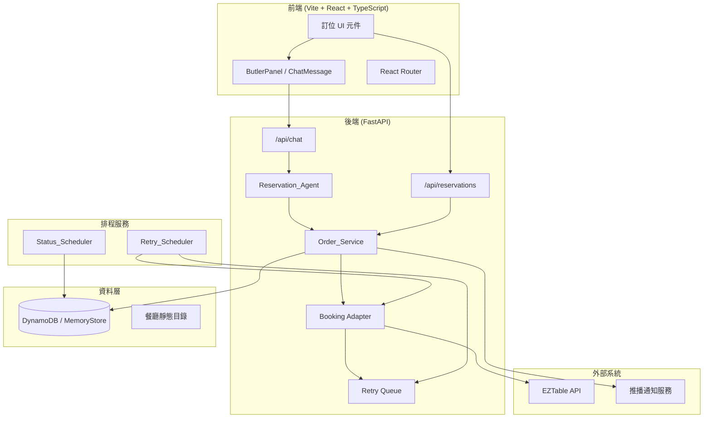
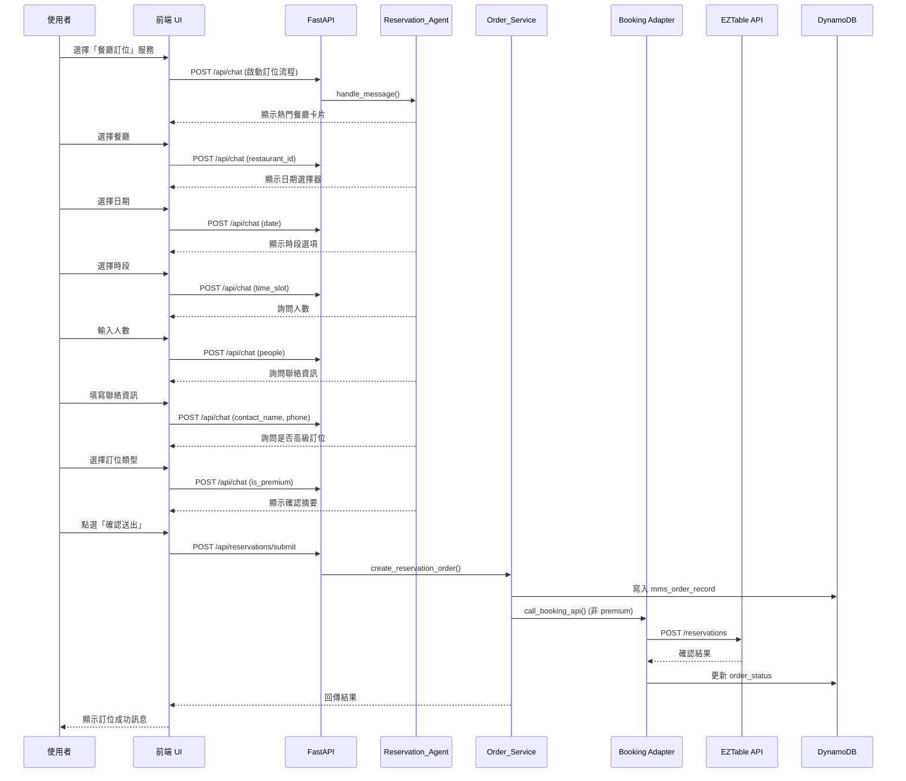
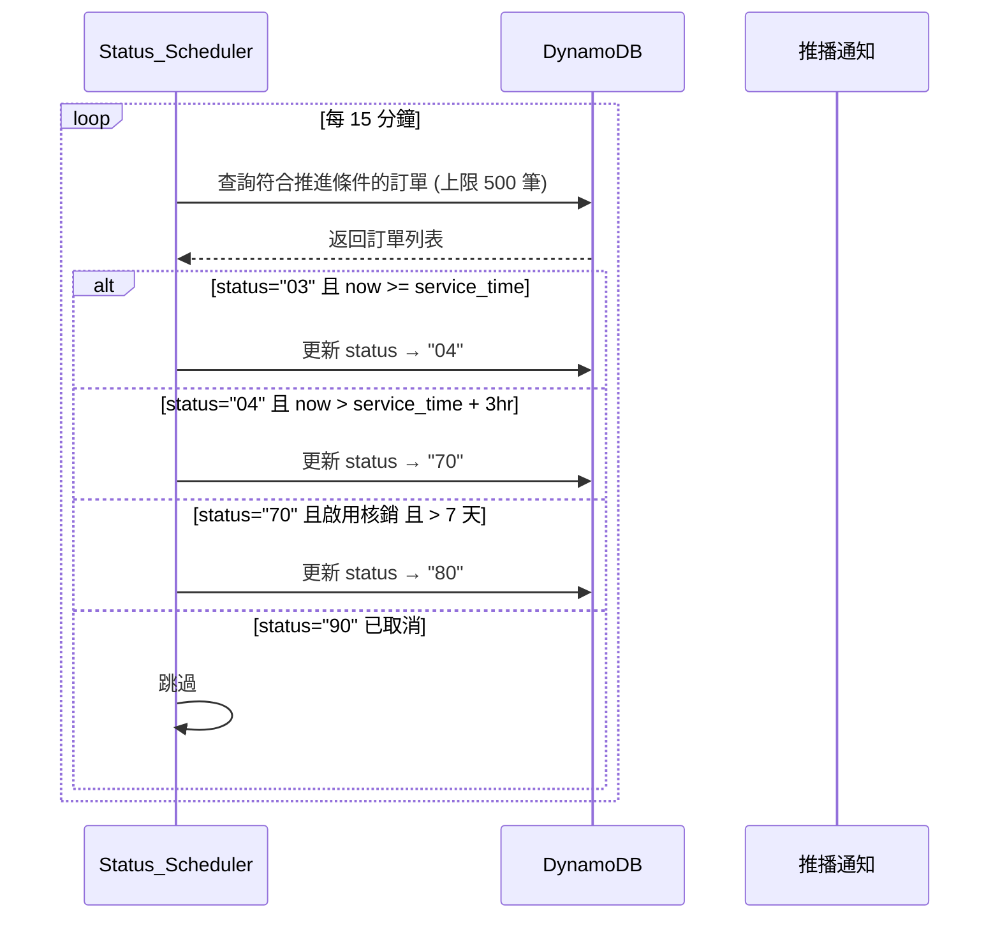
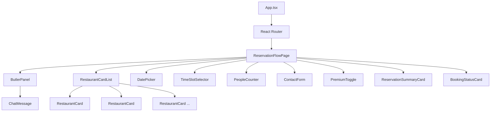
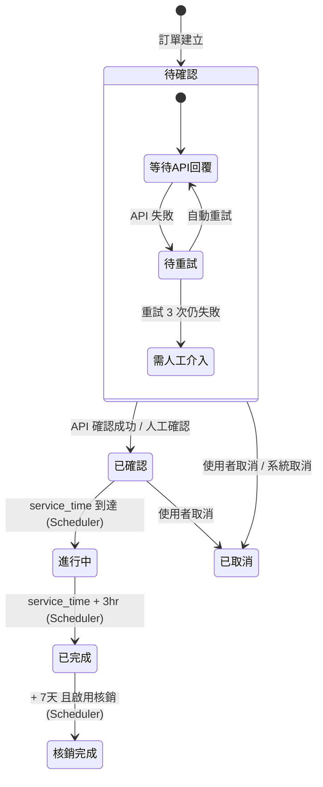
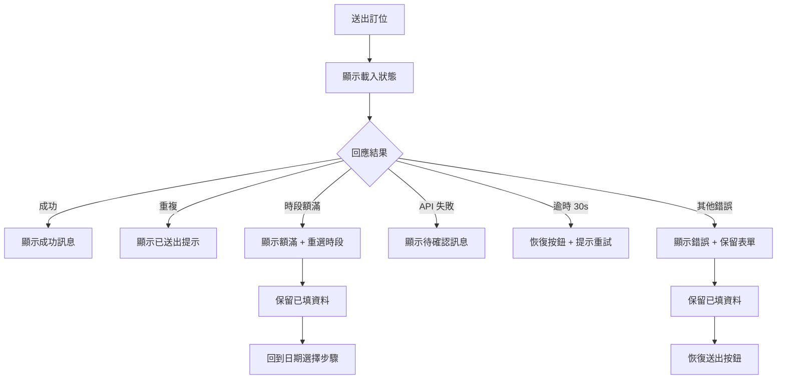

# 設計文件：餐廳訂位功能

## 概述 (Overview)

本設計文件描述「餐廳訂位」功能的技術架構與實作細節。此功能擴展現有的 AI 智慧生活服務管家系統，讓高齡使用者透過對話式「一次一問」流程完成餐廳訂位。系統支援兩條路徑：(1) 串接第三方訂位系統（EZTable API）即時確認，(2) 建立諮詢單由客服人工媒合。

### 設計目標

- 無縫整合既有服務框架（catalog + store + agent 模式）
- 維持「一次一問」對話體驗的一致性
- 支援第三方 API 串接與失敗降級
- 自動化訂單狀態生命週期管理
- 高齡友善介面規範一致性

### 設計決策摘要

| 決策 | 選擇 | 理由 |
|------|------|------|
| 資料儲存 | 擴展既有 mms_order_record 模式 | 維持單一資料表設計，與現有訂單系統統一 |
| 狀態管理 | 獨立排程 Job | 解耦主 API 服務，避免影響使用者請求回應時間 |
| 第三方整合 | Adapter Pattern | 未來可替換不同訂位平台 |
| 前端路由 | 複用 ServiceFormPage 模式 | 維持 schema-driven 渲染一致性 |
| 重試機制 | 指數退避 + 最大 3 次 | 平衡即時性與系統負載 |

## 架構 (Architecture)

### 系統架構圖



### 訂位流程序列圖



### 狀態自動推進序列圖



## 元件與介面 (Components and Interfaces)

### 後端元件

#### 1. 餐廳目錄模組 (`backend/app/services/restaurant_catalog.py`)

負責管理餐廳靜態資料，提供查詢介面。

```python
# 介面定義
def list_restaurants(limit: int = 6) -> list[RestaurantInfo]
def get_restaurant(restaurant_id: str) -> RestaurantInfo | None
def supports_third_party_booking(restaurant_id: str) -> bool
```

#### 2. 訂位服務模組 (`backend/app/services/reservation.py`)

核心業務邏輯，負責訂位訂單的建立與管理。

```python
# 介面定義
def create_reservation_order(
    actor_id: str,
    reservation_data: ReservationData,
    session_id: str | None = None,
) -> ReservationResult

def check_duplicate(
    actor_id: str,
    restaurant_id: str,
    date: str,
    time_slot: str,
) -> bool

def get_reservation_order(actor_id: str, request_id: str) -> dict | None
```

#### 3. 第三方訂位 Adapter (`backend/app/services/booking_adapter.py`)

封裝第三方 API 呼叫邏輯，提供統一介面。

```python
# 介面定義
class BookingAdapter:
    async def create_booking(
        self,
        restaurant_id: str,
        reservation: ReservationData,
    ) -> BookingResult

    async def check_availability(
        self,
        restaurant_id: str,
        date: str,
        time_slot: str,
    ) -> AvailabilityResult
```

#### 4. 重試服務 (`backend/app/services/retry_service.py`)

管理失敗訂單的重試邏輯。

```python
# 介面定義
def mark_for_retry(request_id: str) -> None
def process_retry_queue() -> RetryBatchResult
def get_retry_count(request_id: str) -> int
```

#### 5. 狀態排程器 (`backend/app/scheduler/status_scheduler.py`)

獨立於主 API 的批次排程 Job。

```python
# 介面定義
def run_status_advancement() -> SchedulerResult
def advance_single_order(order: dict) -> bool
```

### 後端 API 端點

#### 新增端點

| Method | Path | 說明 |
|--------|------|------|
| GET | `/api/restaurants` | 取得熱門餐廳清單 |
| GET | `/api/restaurants/{id}` | 取得單一餐廳詳細資訊 |
| POST | `/api/reservations/submit` | 送出訂位請求，建立訂單 |
| GET | `/api/reservations/{request_id}` | 取得訂位訂單詳情 |
| POST | `/api/reservations/{request_id}/cancel` | 取消訂位 |
| POST | `/api/webhooks/booking-callback` | 接收第三方非同步回傳結果 |

#### API 請求/回應模型

```python
# POST /api/reservations/submit
class ReservationSubmitRequest(BaseModel):
    session_id: str
    restaurant_id: str
    restaurant_name: str
    date: str  # YYYY-MM-DD
    time_slot: str  # "LUNCH" | "DINNER"
    specific_time: str | None = None  # "HH:MM"
    people: int = Field(ge=1, le=20)
    contact_name: str = Field(min_length=1, max_length=50)
    phone: str = Field(pattern=r"^09\d{8}$")
    is_premium: bool = False
    preference_note: str | None = Field(default=None, max_length=200)

class ReservationSubmitResponse(BaseModel):
    success: bool
    request_id: str | None = None
    order_status: str | None = None
    booking_url: str | None = None
    error: ErrorDetail | None = None
```

### 前端元件

#### 新增頁面

| 元件 | 路徑 | 說明 |
|------|------|------|
| `ReservationFlowPage` | `/services/restaurant_reservation` | 訂位流程主頁面，承載對話式 UI |

#### 新增元件

| 元件 | 說明 |
|------|------|
| `RestaurantCard` | 單張餐廳精選卡片，呈現名稱、地址、電話 |
| `RestaurantCardList` | 最多 6 張卡片的水平滾動列表 |
| `DatePicker` | 日期選擇器，限制 [today, today+60] |
| `TimeSlotSelector` | 午餐/晚餐時段選擇 + 30 分鐘精細時間 |
| `PeopleCounter` | +/- 按鈕人數選擇器，範圍 [1, 20] |
| `ContactForm` | 聯絡人姓名 + 手機號碼表單 |
| `PremiumToggle` | 高級訂位二選一選項 |
| `ReservationSummaryCard` | 確認摘要卡片，含所有訂位資訊 |
| `BookingStatusCard` | 訂位狀態展示卡片（含確認連結） |

#### 前端元件層級圖



## 資料模型 (Data Models)

### 1. 餐廳目錄資料結構 (Restaurant Catalog)

```python
# backend/app/services/restaurant_catalog.py

RESTAURANTS: list[dict] = [
    {
        "id": "r001",
        "name": "22世紀風味館 信義旗艦店",
        "brand": "22世紀風味館",
        "address": "台北市信義區松高路12號3樓",
        "phone": "02-2723-0022",
        "cuisine": "複合式料理",
        "supports_booking_api": True,
        "verification_enabled": True,
        "image_url": "/images/restaurants/r001.jpg",
    },
    {
        "id": "r002",
        "name": "22世紀風味館 板橋文化店",
        "brand": "22世紀風味館",
        "address": "新北市板橋區文化路一段280號2樓",
        "phone": "02-2258-0022",
        "cuisine": "複合式料理",
        "supports_booking_api": True,
        "verification_enabled": True,
        "image_url": "/images/restaurants/r002.jpg",
    },
    {
        "id": "r003",
        "name": "22世紀風味館 台中公益店",
        "brand": "22世紀風味館",
        "address": "台中市南屯區公益路二段51號",
        "phone": "04-2326-0022",
        "cuisine": "複合式料理",
        "supports_booking_api": True,
        "verification_enabled": False,
        "image_url": "/images/restaurants/r003.jpg",
    },
    {
        "id": "r004",
        "name": "22世紀風味館 高雄夢時代店",
        "brand": "22世紀風味館",
        "address": "高雄市前鎮區中華五路789號B1",
        "phone": "07-812-0022",
        "cuisine": "複合式料理",
        "supports_booking_api": True,
        "verification_enabled": True,
        "image_url": "/images/restaurants/r004.jpg",
    },
    {
        "id": "r005",
        "name": "22世紀風味館 桃園中正店",
        "brand": "22世紀風味館",
        "address": "桃園市桃園區中正路1055號",
        "phone": "03-356-0022",
        "cuisine": "複合式料理",
        "supports_booking_api": False,
        "verification_enabled": False,
        "image_url": "/images/restaurants/r005.jpg",
    },
    {
        "id": "r006",
        "name": "22世紀風味館 新竹巨城店",
        "brand": "22世紀風味館",
        "address": "新竹市東區中央路229號4樓",
        "phone": "03-623-0022",
        "cuisine": "複合式料理",
        "supports_booking_api": True,
        "verification_enabled": True,
        "image_url": "/images/restaurants/r006.jpg",
    },
]
```

### 2. 前端餐廳卡片資料

```typescript
// frontend/src/data/restaurants.ts

export interface RestaurantInfo {
  id: string;
  name: string;
  brand: string;
  address: string;
  phone: string;
  cuisine: string;
  supports_booking_api: boolean;
  image_url: string;
}

export const FEATURED_RESTAURANTS: RestaurantInfo[] = [
  {
    id: "r001",
    name: "22世紀風味館 信義旗艦店",
    brand: "22世紀風味館",
    address: "台北市信義區松高路12號3樓",
    phone: "02-2723-0022",
    cuisine: "複合式料理",
    supports_booking_api: true,
    image_url: "/images/restaurants/r001.jpg",
  },
  // ... 其餘 5 間分店
];
```

### 3. 訂位訂單資料結構 (mms_order_record)

延伸既有 Store 的 PK/SK 模式：

```python
# DynamoDB / MemoryStore 記錄格式
{
    "PK": "USER#{actor_id}",
    "SK": "REQUEST#{request_id}",
    "entity_type": "SERVICE_REQUEST",
    "request_id": "REQ-20250625-001",
    "session_id": "sess_abc123",
    "service_id": "restaurant_reservation",
    "service_name": "餐廳訂位",
    "order_type": "02",
    "order_status": "02",  # 02=待確認, 03=已確認, 04=進行中, 70=已完成, 80=核銷完成, 90=已取消
    "order_items": {
        "restaurant_id": "r001",
        "restaurant_name": "22世紀風味館 信義旗艦店",
        "restaurant_phone": "02-2723-0022",
        "restaurant_address": "台北市信義區松高路12號3樓",
        "people": 4,
        "is_premium": False,
        "reserved_date": "2025-06-28",
        "time_slot": "LUNCH",
        "specific_time": "12:30",
        "contact_name": "王大明",
        "phone": "0912345678",
        "preference_note": None,
    },
    "service_time": "2025-06-28T12:30:00+08:00",  # ISO 8601 + timezone
    "vendor_data": {
        "booking_id": "EZ-2025-xxxx",
        "share_reservation_url": "https://eztable.com/booking/xxx",
        "confirmed_at": "2025-06-25T15:30:00+08:00",
    },
    "retry_info": {
        "retry_count": 0,
        "max_retries": 3,
        "last_retry_at": None,
        "needs_manual": False,
    },
    "status_history": [
        {"status": "02", "at": "2025-06-25T14:00:00+08:00"},
        {"status": "03", "at": "2025-06-25T15:30:00+08:00"},
    ],
    "created_at": "2025-06-25T14:00:00+08:00",
    "updated_at": "2025-06-25T15:30:00+08:00",
}
```

### 4. 訂單狀態機



**狀態碼對照表：**

| 狀態碼 | 名稱 | 說明 |
|--------|------|------|
| `02` | 待確認 | 訂單已建立，等待第三方確認或客服處理 |
| `03` | 已確認 | 訂位確認成功 |
| `04` | 進行中 | 用餐時間已到 |
| `70` | 已完成 | 用餐時間 + 3 小時 |
| `80` | 核銷完成 | 已完成 + 7 天（啟用核銷時） |
| `90` | 已取消 | 使用者或系統取消 |

### 5. 第三方 API 整合模型

#### EZTable API Adapter 介面

```python
# backend/app/services/booking_adapter.py

from pydantic import BaseModel
from enum import Enum

class BookingStatus(str, Enum):
    CONFIRMED = "CONFIRMED"           # 即時確認
    PENDING_CONFIRMATION = "PENDING"  # 需餐廳確認
    NO_AVAILABILITY = "NO_AVAILABILITY"  # 時段額滿
    ERROR = "ERROR"                   # 系統錯誤

class BookingResult(BaseModel):
    status: BookingStatus
    booking_id: str | None = None
    share_reservation_url: str | None = None
    message: str | None = None

class AvailabilityResult(BaseModel):
    available: bool
    alternative_slots: list[str] = []

class EZTableAdapter:
    """EZTable API 封裝層"""

    BASE_URL = "https://api.eztable.com/v1"
    TIMEOUT_SECONDS = 10  # Requirement 9.1: 10 秒逾時

    async def create_booking(
        self,
        restaurant_id: str,
        date: str,
        time: str,
        people: int,
        contact_name: str,
        phone: str,
    ) -> BookingResult:
        """
        呼叫 EZTable 建立訂位
        - 成功: 返回 CONFIRMED + booking_id + URL
        - 需確認: 返回 PENDING
        - 額滿: 返回 NO_AVAILABILITY
        - 逾時/錯誤: 返回 ERROR
        """
        ...

    async def check_availability(
        self,
        restaurant_id: str,
        date: str,
        time_slot: str,
    ) -> AvailabilityResult:
        """查詢指定時段是否有空位"""
        ...
```

### 6. 前端服務註冊 (擴展 services.ts)

```typescript
// frontend/src/data/services.ts - 新增 restaurant_reservation

{
  service_id: "restaurant_reservation",
  title: "餐廳訂位",
  subtitle: "22世紀風味館 精選餐廳訂位服務",
  description: "為您預約精選餐廳座位，享受美食無煩惱。",
  icon: "restaurant",  // 新增 icon type
  fields: [
    {
      id: "restaurant_id",
      label: "餐廳選擇",
      type: "select",
      required: true,
      hint: "請選擇想去的餐廳",
      sectionTitle: "餐廳資訊",
      inputIcon: "restaurant",
    },
    {
      id: "reserved_date",
      label: "用餐日期",
      type: "date",
      required: true,
      hint: "請選擇用餐日期（60天內）",
      sectionTitle: "預約時間",
      inputIcon: "calendar",
    },
    {
      id: "time_slot",
      label: "用餐時段",
      type: "select",
      required: true,
      options: ["LUNCH", "DINNER"],
      hint: "午餐 11:00-14:00 / 晚餐 17:00-21:00",
      sectionTitle: "預約時間",
      inputIcon: "clock",
    },
    {
      id: "people",
      label: "用餐人數",
      type: "number",
      required: true,
      hint: "1-20 人",
      placeholder: "2",
      sectionTitle: "用餐資訊",
      inputIcon: "check",
    },
    {
      id: "contact_name",
      label: "聯絡人姓名",
      type: "text",
      required: true,
      hint: "1-50 個字元",
      sectionTitle: "聯絡資訊",
      inputIcon: "check",
    },
    {
      id: "phone",
      label: "聯絡電話",
      type: "text",
      required: true,
      hint: "台灣手機號碼 09 開頭 10 碼",
      placeholder: "0912345678",
      sectionTitle: "聯絡資訊",
      inputIcon: "phone",
    },
    {
      id: "is_premium",
      label: "訂位類型",
      type: "select",
      required: true,
      options: ["STANDARD", "PREMIUM"],
      hint: "高級訂位將由專人安排",
      sectionTitle: "訂位偏好",
      inputIcon: "check",
    },
  ],
}
```

### 7. 後端服務目錄註冊 (擴展 catalog.py)

```python
# backend/app/services/catalog.py - 新增 restaurant_reservation

{
    "id": "restaurant_reservation",
    "name": "餐廳訂位",
    "description": "22世紀風味館 精選餐廳訂位服務",
    "service_vendor_id": 22,
    "cms_type": "02",  # order_type
    "enabled": True,
    "keywords": ["餐廳", "訂位", "預約", "用餐", "22世紀", "風味館"],
    "schema": {
        "fields": [
            {
                "id": "restaurant_id",
                "label": "餐廳選擇",
                "type": "restaurant_select",
                "required": True,
                "question": "請選擇想去的餐廳，或由客服協助媒合。",
            },
            {
                "id": "reserved_date",
                "label": "用餐日期",
                "type": "date",
                "required": True,
                "question": "請問希望哪一天用餐？",
            },
            {
                "id": "time_slot",
                "label": "用餐時段",
                "type": "select",
                "required": True,
                "options": ["LUNCH", "DINNER"],
                "question": "請問想約午餐還是晚餐？",
            },
            {
                "id": "specific_time",
                "label": "用餐時間",
                "type": "time_select",
                "required": False,
                "question": "可以再指定一下幾點鐘嗎？（每 30 分鐘一個時段）",
            },
            {
                "id": "people",
                "label": "用餐人數",
                "type": "number",
                "required": True,
                "question": "請問幾位用餐？",
            },
            {
                "id": "contact_name",
                "label": "聯絡人姓名",
                "type": "text",
                "required": True,
                "question": "請問訂位人的姓名？",
            },
            {
                "id": "phone",
                "label": "聯絡電話",
                "type": "text",
                "required": True,
                "question": "請提供聯絡手機號碼。",
            },
            {
                "id": "is_premium",
                "label": "訂位類型",
                "type": "select",
                "required": True,
                "options": ["STANDARD", "PREMIUM"],
                "question": "請問需要指定餐廳或高級訂位服務嗎？",
            },
        ],
    },
}
```

### 8. Status Scheduler 批次 Job 設計

```python
# backend/app/scheduler/status_scheduler.py

from datetime import datetime, timedelta, timezone
from ..services.store import STORE

TZ = timezone(timedelta(hours=8))
BATCH_SIZE = 500

class StatusScheduler:
    """
    獨立排程 Job，每 15 分鐘執行一次。
    負責根據 service_time 自動推進訂單狀態。
    """

    def run(self) -> dict:
        """
        執行狀態推進批次作業。
        Returns: { processed: int, advanced: int, errors: int }
        """
        now = datetime.now(TZ)
        orders = self._query_eligible_orders(limit=BATCH_SIZE)
        results = {"processed": 0, "advanced": 0, "errors": 0}

        for order in orders:
            try:
                advanced = self._try_advance(order, now)
                results["processed"] += 1
                if advanced:
                    results["advanced"] += 1
            except Exception as e:
                results["errors"] += 1
                self._log_error(order["request_id"], e)
                continue  # Requirement 11.6: 不中斷整批作業

        return results

    def _try_advance(self, order: dict, now: datetime) -> bool:
        status = order["order_status"]
        service_time = datetime.fromisoformat(order["service_time"])

        # 跳過已取消/已退款 (Requirement 11.5)
        if status in ("90", "91"):
            return False

        # 03 → 04: service_time 已到 (Requirement 11.1)
        if status == "03" and now >= service_time:
            order["order_status"] = "04"
            STORE.save_request(order["PK"].replace("USER#", ""), order)
            return True

        # 04 → 70: service_time + 3hr (Requirement 11.2)
        if status == "04" and now >= service_time + timedelta(hours=3):
            order["order_status"] = "70"
            STORE.save_request(order["PK"].replace("USER#", ""), order)
            return True

        # 70 → 80: + 7天 且啟用核銷 (Requirement 11.3)
        if status == "70":
            verification_enabled = order.get("order_items", {}).get(
                "verification_enabled", False
            )
            status_70_time = self._get_status_change_time(order, "70")
            if (
                verification_enabled
                and status_70_time
                and now >= status_70_time + timedelta(days=7)
            ):
                order["order_status"] = "80"
                STORE.save_request(order["PK"].replace("USER#", ""), order)
                return True

        return False
```

### 9. 重試機制設計

```python
# backend/app/scheduler/retry_scheduler.py

from datetime import timedelta

RETRY_INTERVAL = timedelta(minutes=5)  # Requirement 9.4
MAX_RETRIES = 3  # Requirement 9.4, 9.5

class RetryScheduler:
    """
    處理待重試的訂位訂單。
    每 5 分鐘檢查一次，對待重試訂單重新呼叫 Third_Party_Booking_API。
    """

    async def process_retry_queue(self) -> dict:
        """
        Returns: { processed: int, succeeded: int, failed: int, escalated: int }
        """
        pending = self._get_pending_retries()
        results = {"processed": 0, "succeeded": 0, "failed": 0, "escalated": 0}

        for order in pending:
            retry_count = order.get("retry_info", {}).get("retry_count", 0)

            if retry_count >= MAX_RETRIES:
                # Requirement 9.5: 達最大重試次數，標記需人工介入
                self._escalate_to_manual(order)
                results["escalated"] += 1
                continue

            result = await self._retry_booking(order)
            results["processed"] += 1

            if result.status == "CONFIRMED":
                # Requirement 9.6: 重試成功
                self._update_order_confirmed(order, result)
                results["succeeded"] += 1
            else:
                self._increment_retry_count(order)
                results["failed"] += 1

        return results
```

### 10. 驗證邏輯模組

```python
# backend/app/services/reservation_validators.py

import re
from datetime import date, timedelta, datetime, timezone

TZ = timezone(timedelta(hours=8))

def validate_phone(phone: str) -> bool:
    """台灣手機號碼驗證：09 開頭、共 10 碼純數字 (Requirement 5.3)"""
    return bool(re.match(r"^09\d{8}$", phone))

def validate_contact_name(name: str) -> bool:
    """聯絡人姓名驗證：1-50 字元，不可為空白 (Requirement 5.1, 5.6)"""
    stripped = name.strip()
    return 1 <= len(stripped) <= 50

def validate_date(selected_date: str) -> bool:
    """日期驗證：今日起 60 天內 (Requirement 3.2, 3.5)"""
    try:
        d = date.fromisoformat(selected_date)
        today = datetime.now(TZ).date()
        return today <= d <= today + timedelta(days=60)
    except ValueError:
        return False

def validate_people(people: int) -> bool:
    """人數驗證：1-20 人正整數 (Requirement 4.2, 4.5)"""
    return isinstance(people, int) and 1 <= people <= 20

def validate_time_slot(time_slot: str) -> bool:
    """時段驗證 (Requirement 3.4)"""
    return time_slot in ("LUNCH", "DINNER")

def validate_specific_time(time_slot: str, specific_time: str) -> bool:
    """30 分鐘間隔精細時間驗證 (Requirement 3.4)"""
    valid_lunch = [f"{h:02d}:{m:02d}" for h in range(11, 14) for m in (0, 30)]
    valid_dinner = [f"{h:02d}:{m:02d}" for h in range(17, 21) for m in (0, 30)]

    if time_slot == "LUNCH":
        return specific_time in valid_lunch
    elif time_slot == "DINNER":
        return specific_time in valid_dinner
    return False

def validate_preference_note(note: str | None) -> bool:
    """偏好需求文字驗證：最多 200 字 (Requirement 2.3)"""
    if note is None:
        return True
    return len(note) <= 200

def build_service_time(date_str: str, specific_time: str | None, time_slot: str) -> str:
    """
    組合 service_time ISO 8601 格式 (Requirement 7.3)
    若無 specific_time，使用時段預設時間（午餐 12:00, 晚餐 18:00）
    """
    if specific_time:
        return f"{date_str}T{specific_time}:00+08:00"
    default_time = "12:00" if time_slot == "LUNCH" else "18:00"
    return f"{date_str}T{default_time}:00+08:00"
```

## 正確性屬性 (Correctness Properties)

*正確性屬性（Property）是指在系統所有合法執行路徑中都應成立的特性——本質上是對系統行為的形式化陳述。屬性是人類可讀規格與機器可驗證正確性保證之間的橋樑。*

### Property 1: 日期範圍驗證

*For any* 日期字串 `d`，`validate_date(d)` 回傳 `true` 若且唯若 `d` 是有效 ISO 日期格式，且滿足 `today <= d <= today + 60 天`。對於任何過去日期或超過 60 天的日期，驗證必須回傳 `false`。

**Validates: Requirements 3.2, 3.5**

### Property 2: 用餐人數範圍驗證

*For any* 整數 `n`，`validate_people(n)` 回傳 `true` 若且唯若 `1 <= n <= 20`。對於任何非正整數（包含 0、負數、浮點數、空值），驗證必須回傳 `false`。

**Validates: Requirements 4.2, 4.5**

### Property 3: 台灣手機號碼格式驗證

*For any* 字串 `s`，`validate_phone(s)` 回傳 `true` 若且唯若 `s` 精確匹配 `^09\d{8}$` 模式（09 開頭、共 10 碼純數字、不含空格或符號）。

**Validates: Requirements 5.3**

### Property 4: 聯絡人姓名長度驗證

*For any* 字串 `s`，`validate_contact_name(s)` 回傳 `true` 若且唯若去除首尾空白後的長度滿足 `1 <= len(s.strip()) <= 50`。純空白字串必須被拒絕。

**Validates: Requirements 5.1, 5.6**

### Property 5: 訂單建立資料完整性（Round-Trip）

*For any* 合法的 `ReservationData` 物件（含 restaurant_id, date, time_slot, people, contact_name, phone, is_premium），呼叫 `create_reservation_order()` 後，透過 `get_reservation_order()` 查詢取回的記錄應包含所有原始欄位值且完全一致，order_type 為 "02"，初始 order_status 為 "02"，且 service_time 為有效的 ISO 8601 格式含 +08:00 時區。

**Validates: Requirements 7.1, 7.2, 7.3**

### Property 6: 第三方 API 回應狀態轉換

*For any* 訂位訂單，當 Booking Adapter 返回結果時：
- 若回應為 `CONFIRMED` → order_status 必須變為 "03" 且 vendor_data 包含 booking_id
- 若回應為 `PENDING` 或 `ERROR` 或餐廳不支援 API → order_status 必須維持 "02"
- 無論何種回應，訂單記錄本身不得遺失

**Validates: Requirements 8.2, 8.4, 8.5, 9.1**

### Property 7: 狀態排程器正確推進

*For any* 訂單 `o` 與時間點 `now`：
- 若 `o.status == "03"` 且 `now >= o.service_time` → 推進後 status 必須為 "04"
- 若 `o.status == "04"` 且 `now >= o.service_time + 3hr` → 推進後 status 必須為 "70"
- 若 `o.status == "70"` 且 `verification_enabled == true` 且 `now >= status_70_time + 7d` → 推進後 status 必須為 "80"
- 若 `o.status in ("90", "91")` → status 不得被修改

**Validates: Requirements 11.1, 11.2, 11.3, 11.5**

### Property 8: 重複提交冪等性

*For any* 使用者與訂位組合 `(user_id, restaurant_id, date, time_slot)`，連續兩次呼叫 `create_reservation_order()` 應有且僅有一筆訂單被成功建立，第二次呼叫必須被阻擋並回傳重複偵測結果。

**Validates: Requirements 12.3**

### Property 9: Premium 旗標與路由正確性

*For any* 訂位訂單：
- 若使用者選擇 `is_premium == true` → order_items.is_premium 必須為 true 且 Booking Adapter 不得被呼叫
- 若使用者選擇 `is_premium == false` → order_items.is_premium 必須為 false 且（若餐廳支援）Booking Adapter 應被呼叫

**Validates: Requirements 13.2, 13.3, 13.4**

### Property 10: 表單資料保存（導航不變性）

*For any* 已填寫的表單狀態，當使用者執行「返回修改」操作或因時段額滿重新選擇時，所有先前已收集的欄位值（restaurant_id, people, contact_name, phone）必須被完整保留，不得遺失或清空。

**Validates: Requirements 6.3, 10.2**

## 錯誤處理 (Error Handling)

### 錯誤類別與回應策略

| 錯誤場景 | 處理策略 | 使用者訊息 |
|----------|----------|-----------|
| 服務目錄載入失敗 | 降級至「客服協助媒合」 | 「目前無法載入餐廳清單，您可以留下需求由客服為您安排」 |
| 第三方 API 逾時 (>10s) | 保存訂單 + 標記待重試 | 「訂位已送出，目前待確認中，客服將盡快為您處理」 |
| 第三方 API HTTP 錯誤 | 保存訂單 + 標記待重試 | 同上 |
| 訂單建立失敗 (DB 錯誤) | 10 秒內回應 + 保留表單 | 「抱歉，訂位未成功送出，請重新嘗試」 |
| 時段額滿 | 引導重選 + 保留已填資料 | 「該時段已無空位，建議選擇其他時段」 |
| 重複提交偵測 | 阻擋新建 + 友善提示 | 「這筆訂位已經成功送出囉，無需重複提交」 |
| 重試 3 次仍失敗 | 標記需人工介入 | 推播通知「您的訂位正由客服人員處理中」 |
| Scheduler 單筆失敗 | 記錄錯誤 + 繼續處理 | 無使用者可見訊息（背景作業） |

### 錯誤碼定義

```python
class ReservationErrorCode(str, Enum):
    SERVICE_UNAVAILABLE = "SERVICE_UNAVAILABLE"        # 服務暫時不可用
    RESTAURANT_NOT_FOUND = "RESTAURANT_NOT_FOUND"      # 餐廳不存在
    INVALID_DATE = "INVALID_DATE"                       # 日期不合法
    INVALID_TIME_SLOT = "INVALID_TIME_SLOT"            # 時段不合法
    INVALID_PEOPLE_COUNT = "INVALID_PEOPLE_COUNT"      # 人數不合法
    INVALID_PHONE = "INVALID_PHONE"                     # 手機格式錯誤
    INVALID_CONTACT_NAME = "INVALID_CONTACT_NAME"      # 姓名格式錯誤
    DUPLICATE_RESERVATION = "DUPLICATE_RESERVATION"    # 重複訂位
    BOOKING_API_TIMEOUT = "BOOKING_API_TIMEOUT"        # 第三方 API 逾時
    BOOKING_API_ERROR = "BOOKING_API_ERROR"            # 第三方 API 錯誤
    NO_AVAILABILITY = "NO_AVAILABILITY"                 # 時段額滿
    ORDER_SAVE_FAILED = "ORDER_SAVE_FAILED"            # 訂單儲存失敗
    PREFERENCE_TOO_LONG = "PREFERENCE_TOO_LONG"        # 偏好描述超過 200 字
```

### 前端錯誤處理流程



## 測試策略 (Testing Strategy)

### 測試方法概述

本功能採用雙軌測試方法：

1. **單元測試 (Unit Tests)** — 驗證特定範例、邊界條件、錯誤處理
2. **Property-Based Tests (PBT)** — 驗證跨所有合法輸入的通用屬性

兩者互補：單元測試捕捉具體 bug，PBT 驗證通用正確性。

### Property-Based Testing 框架

- **後端 (Python)**: 使用 [Hypothesis](https://hypothesis.readthedocs.io/) 函式庫
- **前端 (TypeScript)**: 使用 [fast-check](https://fast-check.dev/) 函式庫
- **每個 Property Test 最低 100 次迭代**

### PBT 測試對應

| Property | 測試檔案 | 標記 |
|----------|----------|------|
| Property 1: 日期範圍驗證 | `test_reservation_validators.py` | Feature: restaurant-reservation, Property 1: Date range validation |
| Property 2: 用餐人數範圍驗證 | `test_reservation_validators.py` | Feature: restaurant-reservation, Property 2: People count validation |
| Property 3: 手機號碼格式驗證 | `test_reservation_validators.py` | Feature: restaurant-reservation, Property 3: Phone format validation |
| Property 4: 姓名長度驗證 | `test_reservation_validators.py` | Feature: restaurant-reservation, Property 4: Name length validation |
| Property 5: 訂單建立資料完整性 | `test_reservation_service.py` | Feature: restaurant-reservation, Property 5: Order creation round-trip |
| Property 6: API 回應狀態轉換 | `test_booking_adapter.py` | Feature: restaurant-reservation, Property 6: API response status transitions |
| Property 7: 狀態排程器推進 | `test_status_scheduler.py` | Feature: restaurant-reservation, Property 7: Scheduler state advancement |
| Property 8: 重複提交冪等性 | `test_reservation_service.py` | Feature: restaurant-reservation, Property 8: Duplicate submission idempotency |
| Property 9: Premium 旗標路由 | `test_reservation_service.py` | Feature: restaurant-reservation, Property 9: Premium flag routing |
| Property 10: 表單資料保存 | `test_reservation_flow.spec.ts` | Feature: restaurant-reservation, Property 10: Form data preservation |

### 單元測試覆蓋

| 模組 | 測試範圍 |
|------|----------|
| `reservation_validators.py` | 邊界值：空字串、邊界日期、特殊字元 |
| `reservation.py` | 訂單建立成功/失敗、DB 錯誤模擬 |
| `booking_adapter.py` | API 逾時模擬、各種 HTTP 錯誤碼 |
| `status_scheduler.py` | 單筆失敗不中斷、批次上限 500 筆 |
| `retry_scheduler.py` | 重試計數、人工升級 |
| `RestaurantCard.tsx` | 渲染所有必要欄位 |
| `PeopleCounter.tsx` | +/- 按鈕邊界、disabled 狀態 |
| `DatePicker.tsx` | 今日/60天邊界、過去日期不可選 |
| `ReservationSummaryCard.tsx` | 所有欄位呈現完整 |

### 整合測試

| 測試場景 | 說明 |
|----------|------|
| 完整訂位流程 (happy path) | 從選餐廳到確認成功的端對端流程 |
| 第三方 API 降級流程 | API 失敗時訂單保存 + 重試 |
| Scheduler 完整生命週期 | 訂單從建立到核銷的狀態推進 |
| 併發重複提交 | 模擬兩個請求同時送出 |

### 測試配置

```python
# pytest 配置 (conftest.py)
from hypothesis import settings

settings.register_profile(
    "ci",
    max_examples=200,
    deadline=timedelta(seconds=5),
)
settings.register_profile(
    "dev",
    max_examples=100,
    deadline=timedelta(seconds=10),
)
```

```typescript
// vitest 配置 (vitest.config.ts)
// fast-check 預設 num_runs: 100
```
